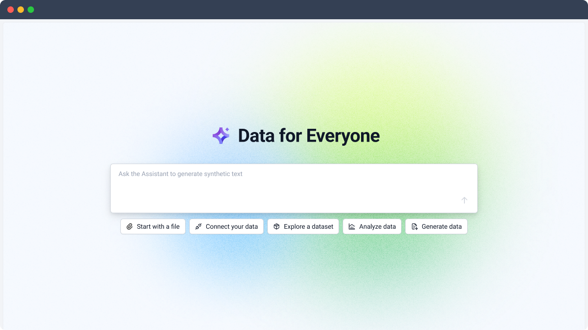
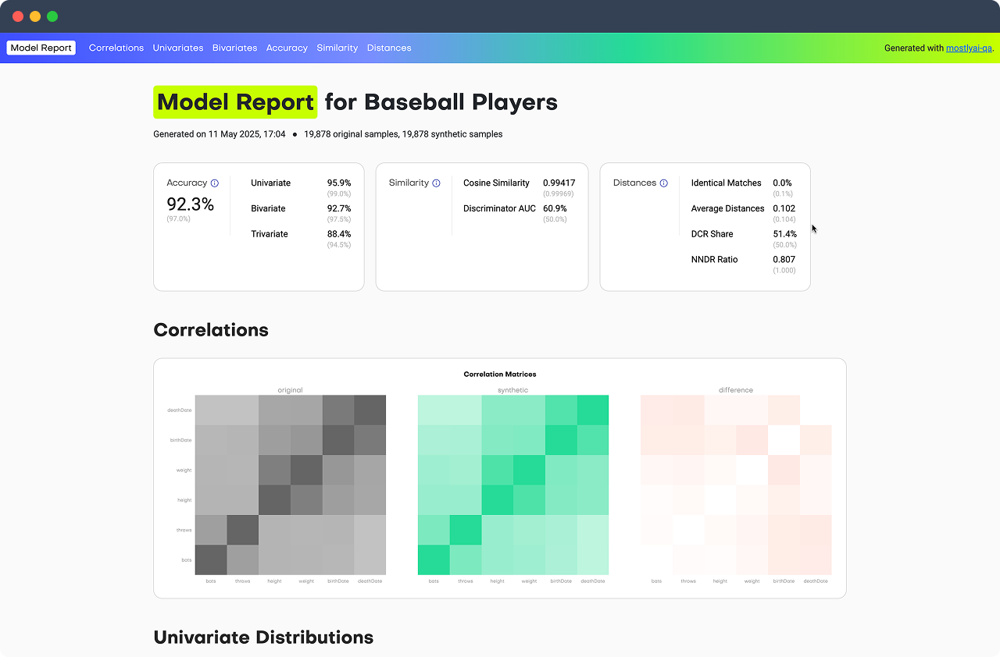

# AWS and MOSTLY AI

## Contents

1. [Introduction](#introduction)
    - [Making the most of Synthetic Data](#making-the-most-of-synthetic-data)
    - [Use cases for Synthetic Data and Mock Data](#use-cases-for-synthetic-data-and-mock-data)
        - [AI training](#ai-training)
        - [Analytics](#analytics)
        - [Testing and QA](#testing-and-qa)
        - [External data sharing](#external-data-sharing)
        - [Cloud migration](#cloud-migration)
        - [Demos and prototypes](#demos-and-prototypes)
        - [Explainable AI](#explainable-ai)
2. [Concepts](#concepts)
    - [What is Synthetic Data?](#what-is-synthetic-data)
    - [What is Mock Data?](#what-is-mock-data)
3. [Getting Started with MOSTLY AI](#getting-started-with-mostly-ai)
    - [Platform](#platform)
        - [AWS Installation Guide](#aws-installation-guide)
    - [Synthetic Data SDK](#synthetic-data-sdk)
    - [MOSTLY AI Model Context Protocol (MCP) Server](#mostly-ai-model-context-protocol-mcp-server)
    - [MOSTLY Mock](#mostly-mock)
    - [Synthetic Data Quality Assurance](#synthetic-data-quality-assurance)
4. [Tutorials](#tutorials)
5. [Contact](#contact)

-----

## Introduction


MOSTLY AI and AWS have announced a strategic partnership to bring world-class synthetic data to everyone. This collaboration combines the enterprise-scale synthetic and mock data generation capabilities of MOSTLY AI with the infrastructure, reach, and services of AWS, enabling organizations to make the most of their data without sacrificing privacy or utility.

Our partnership reflects the rising demand from AWS customers for synthetic data across sectors such as financial services, telecommunications, healthcare and government, recognizing synthetic data as essential for building robust data foundations and enabling agentic AI systems. By uniting technology and strategy, AWS and MOSTLY AI are working hand in hand with joint customers to address these needs and unlock new opportunities.

With over 8 years of experience and deep expertise in serving highly regulated industries, MOSTLY AI is the only enterprise grade open source synthetic data solution on the market today. Together with AWS, we are delivering a solution that can be used across an entire organization, treating synthetic data as a first-class citizen that coexists with real data to strengthen data foundations. With MOSTLY AI and AWS, enterprises gain the ability to safely scale analytics, AI training, and innovation, while ensuring privacy and compliance remain intact.

The MOSTLY AI platform is now available [directly on AWS Marketplace](https://aws.amazon.com/marketplace/pp/prodview-clqfgzfzznfoc) and is integrated with [Amazon SageMaker](https://aws.amazon.com/sagemaker/) and [Amazon Clean Rooms](https://aws.amazon.com/clean-rooms/), including open-source model support for TabularARGN, providing a seamless path for customers to adopt synthetic data at scale.

> For further context on the potential of synthetic data as a cornerstone of AI-ready data strategies, see the recent research paper, [*TabularARGN: A Flexible and Efficient Auto-Regressive Framework for Generating High-Fidelity Synthetic Data*](https://arxiv.org/abs/2501.12012).  

### Making the most of Synthetic Data

[](https://www.youtube.com/watch?v=961lTRpUPuk)

Enterprises are increasingly recognizing that their most valuable data asset, structured customer data, often remains inaccessible due to privacy and compliance constraints. 

This limitation creates barriers for AI training, proof-of-concepts, cloud migration, and secure data collaboration. Unlocking this data safely is critical to enabling enterprise AI adoption at scale.

To address this challenge, AWS is partnering with MOSTLY AI, the industry leader in privacy-preserving structured synthetic data. 

By applying an advanced auto-regressive architecture, MOSTLY AI’s technology creates fully anonymous yet highly representative synthetic datasets for both tabular and time-series data. This allows enterprises to safely utilize their sensitive data assets while ensuring compliance with the strictest regulatory requirements.

### Use cases for Synthetic Data and Mock Data

#### AI training

Synthetic data allows teams to train and evaluate machine learning models without exposing sensitive information. MOSTLY AI ensures this data remains faithful to real-world patterns while preserving privacy, making it safe for large-scale model development.

#### Analytics

Exploratory analysis and business intelligence often get slowed down by the internal approval processes and overburdened data engineers and analytics teams. With MOSTLY AI, teams can freely explore synthetic datasets that mirror the original, enabling rapid insights without compliance barriers.

#### External data sharing

Organizations often need to share data with partners, vendors, or regulators, but direct access to sensitive information is risky. MOSTLY AI enables secure collaboration by generating curated synthetic datasets that preserve statistical value while protecting privacy. This allows teams to exchange meaningful data externally without exposing confidential records.

#### Cloud migration

Moving sensitive data to the cloud can raise compliance and security concerns. With MOSTLY AI, organizations can generate privacy-safe synthetic datasets that mirror production data, enabling smooth migration, validation, and testing of cloud environments without exposing regulated information.

#### Testing and QA

Developers and QA engineers need realistic data to test software, but production data is risky to use. MOSTLY AI generates safe, statistically accurate datasets that populate staging environments, ensuring reliable tests without exposing PII. Mock data can serve as a lightweight alternative in early development stages, where format compliance and coverage of edge cases matter more than exact statistical fidelity.  

#### Demos and prototypes

Product teams often showcase new tools using sensitive data, which risks privacy breaches. MOSTLY AI provides lifelike synthetic data that lets teams build, demo, and prototype products without leaking confidential information. Mock data is also ideal for fast, safe demos where realism is secondary to quickly showing functionality in action.  

#### Explainable AI

Governing AI systems requires stress-testing models on edge cases, outliers, and diverse cohorts. MOSTLY AI can generate synthetic datasets tailored to these scenarios, helping organizations validate fairness, robustness, and compliance.

-----

## Concepts

### What is Synthetic Data?

[](https://www.youtube.com/watch?v=J5n6AllAfJk)

[Synthetic data](https://mostly.ai/synthetic-data-basics) is artificial data generated by AI models trained on real-world datasets. Unlike traditional anonymization techniques such as masking or pseudonymization, which may still leave traces of personal data, synthetic data is created entirely from scratch. The process involves learning the patterns, correlations, and statistical properties of the source data, and then generating brand-new records that preserve these characteristics while containing no privacy-sensitive data. This makes synthetic data a powerful, privacy-preserving stand-in for real data.

When generated effectively, synthetic data is statistically identical to the original dataset, delivering a high level of utility and acting as a perfect proxy, with the same insights and correlations but none of the privacy risks associated with legacy obfuscation techniques.

MOSTLY AI [protects privacy](https://docs.mostly.ai/concepts/privacy-protection) by training generative AI models on real data to learn patterns and distributions, then generating new records from scratch with no one-to-one link to original data. This prevents re-identification, preserves statistical integrity, and ensures safe, compliant data use.

### What is Mock Data?

[Mock data](https://mostly.ai/synthetic-data-dictionary/mock-data) is artificial data that mimics the structure of real datasets but does not reproduce their actual statistical properties or correlations. It is often used for testing, development, and demonstrations where realistic values are helpful but privacy and compliance requirements make the use of real data impractical or statistical properties and correlations are irrelevant.

MOSTLY AI takes mock data generation further by providing [AI-powered tools](#mostly-synthetic-mock) that create complex, multi-table datasets with referential integrity and plausible values across fields according to your defined schema. 

-----

## Getting started with MOSTLY AI

MOSTLY AI addresses one of the biggest challenges in enterprise data today: the fact that the vast majority of data of valuable data is personal, privacy-sensitive, and therefore difficult to access and use. 

As AI and LLMs trained on public data reach saturation, the next phase of innovation will be driven by generative AI applied to proprietary datasets. Yet, most employees lack both the access to granular personal data and the skills to freely analyze and model it. 

MOSTLY AI bridges this gap by combining privacy-preserving synthetic data with AI assistance, enabling organizations to safely unlock and operationalize their most valuable data assets. Together with AWS, MOSTLY AI is bringing this capability to market at scale.

We've developed this guide as an overview of the MOSTLY AI platform and supporting tools that you can use with AWS, SageMaker, and Clean Rooms.

MOSTLY AI is a powerful platform that supports a range of functionalities. These terms will help you understand how the get what you want from the entire MOSTLY AI ecosystem:

1. **Generator**: a generator is a collection of specially trained AI models that are used together to create synthetic data.
2. **Connector**: a connector is a connection string or set of credentials used to connect to an underlying data source or write to an external destination.
3. **Dataset**: a dataset is a set of instructions, file, or connection that allow you to access data that may or may not be stored on the platform.
4. **Synthetic Dataset**: a synthetic dataset is a dataset that has been created using the MOSTLY AI platform or Synthetic Data SDK and contains the features and trends present in a subject dataset.

### Platform



The best place to get started is the [MOSTLY AI platform](http://app.mostly.ai) but we support a number a complementary tools to ensure that you have access to the most realistic mock or synthetic data possible. You can deploy the MOSTLY AI Platform [directly from the AWS Marketplace](https://aws.amazon.com/marketplace/pp/prodview-clqfgzfzznfoc).

> For more information on using the platform effectively, consider the [MOSTLY AI Docs](https://mostly.ai/docs/).

Use the platform to chat with the [MOSTLY AI Assistant](https://www.youtube.com/watch?v=b1HxfurFUVk), who can help you train generators, create synthetic datasets, and configure connectors using natural language prompting. Chatting with the Assistant is the best place to start learning about using MOSTLY AI to create synthetic data.

#### AWS Installation Guide

MOSTLY AI can be installed on your own enterprise infrastructure according to the [AWS Installation Guide](https://github.com/mostly-ai/aws-marketplace).

Check out the [MOSTLY AI AWS Marketplace listing](https://aws.amazon.com/marketplace/pp/prodview-clqfgzfzznfoc) for pricing and purchase instructions and the [deployment video](https://www.youtube.com/watch?v=4MUhPXpHifM) for a quick overview of the installation process.

### Synthetic Data SDK

```python
# Initialize the SDK
from mostlyai.sdk import MostlyAI
mostly = MostlyAI()

# Import a trained generator
g = mostly.generators.import_from_file(
  "https://github.com/mostly-ai/public-demo-data/raw/dev/census/census-generator.zip"
)

# Probe for 1000 representative synthetic samples
df = mostly.probe(g, size=1000)
df
```

The MOSTLY AI platform is powered by the Synthetic Data SDK, an open source toolkit that you can use to create the data you need.

The methods and endpoints of the SDK are [extensively documented](https://api-docs.mostly.ai), including [usage examples and suggested configurations](https://mostly-ai.github.io/mostlyai/), and the entire codebase can be inspected in a [public repository](https://github.com/mostly-ai/mostlyai?tab=readme-ov-file#synthetic-data-sdk-).

### MOSTLY AI Model Context Protocol (MCP) Server

> Configuration instructions and more information, including the entire MCP server codebase, is available in the public [MCP server repository](https://github.com/mostly-ai/mostlyai-mcp-server).

MOSTLY AI supports a dedicated [MCP server](https://modelcontextprotocol.io/docs/getting-started/intro) to connect to LLM agents and tools.

The MCP server provides a set of tools that let users connect to data sources, inspect their schemas, query and read data, and then train, manage, and generate synthetic datasets with MOSTLY AI’s platform. It also includes utilities for managing connectors, generators, compute resources, and monitoring the progress of training or data generation jobs. For details on each tool, users can refer to the documentation.

We recommend using Anthropic's [MCP Inspector](https://modelcontextprotocol.io/legacy/tools/inspector) tool for testing and debugging.

### MOSTLY Synthetic Mock

```python
from mostlyai import mock

tables = {
    "guests": {
        "prompt": "Guests of an Alpine ski hotel in Austria",
        "columns": {
            "nationality": {"prompt": "2-letter code for the nationality", "dtype": "string"},
            "name": {"prompt": "first name and last name of the guest", "dtype": "string"},
            "gender": {"dtype": "category", "values": ["male", "female"]},
            "age": {"prompt": "age in years; min: 18, max: 80; avg: 25", "dtype": "integer"},
            "date_of_birth": {"prompt": "date of birth", "dtype": "date"},
            "checkin_time": {"prompt": "the check in timestamp of the guest; may 2025", "dtype": "datetime"},
            "is_vip": {"prompt": "is the guest a VIP", "dtype": "boolean"},
            "price_per_night": {"prompt": "price paid per night, in EUR", "dtype": "float"},
            "room_number": {"prompt": "room number", "dtype": "integer", "values": [101, 102, 103, 201, 202, 203, 204]}
        },
    }
}
df = mock.sample(
    tables=tables,   # Provide table and column definitions
    sample_size=10,  # Generate 10 records
    model="openai/gpt-4.1-nano",  # Select the LLM model
)
```

Mock data is different from synthetic data in that mock data is created entirely from scratch, with no real data to be modeled on. You can use mock data to expand an existing dataset if you wish, but it is not required to have any data to start the process.

Mock data is helpful for testing data model structure and shape in a development or staging environment, when real-world data may not be available or the underlying data model is subject to rapid iteration and change.

The [MOSTLY Synthetic Mock repository](https://github.com/mostly-ai/mostlyai-mock?tab=readme-ov-file#synthetic-mock-data-) supports natural language prompting and a declarative syntax to ensure that the generated mock data meets your exact requirements.

### Synthetic Data Quality Assurance



The MOSTLY AI Synthetic Data QA library generates HTML reports with metrics to evaluate synthetic data quality. 

The two most common questions when working with synthetic data are: How accurate is it? and Is it privacy-safe? To give users confidence, MOSTLY AI provides fully automated QA metrics that make it easy to assess both quality and privacy. The library compares synthetic vs. original data for accuracy, similarity, and distances, supports contextual and sequential data, allows customization and sampling controls, and returns both a report file and structured metrics.

Accuracy measures how closely synthetic distributions match the training or holdout data, with granular metrics available for univariate, bivariate, trivariate, and sequential patterns. Similarity assesses how alike the overall joint distributions are, using methods such as cosine similarity and discriminator tests to check whether synthetic data is distinguishable from real data. Distances capture novelty and privacy by analyzing nearest-neighbor relationships, duplicate sample rates, and relative closeness between synthetic, training, and holdout datasets. Together, these metrics provide a comprehensive view of how realistic, representative, and private synthetic data is.

> More detailed information on the Synthetic Data Quality Assurance library can be found in the [public repository](https://github.com/mostly-ai/mostlyai-qa).

-----

## Tutorials

While the MOSTLY AI Assistant is a great place for users to begin learning about the MOSTLY AI ecosystem, advanced users might prefer to interact with the SDK directly.

These tutorials provide extensive instructions for all levels of MOSTLY AI users and can help you master Python-language synthetic data generation for a number of use cases.

| Description                                                     | Colab Link                                                                                                                                                                                                                       | Notebook Link                                                                                                              |
| --------------------------------------------------------------- | -------------------------------------------------------------------------------------------------------------------------------------------------------------------------------------------------------------------------------- | -------------------------------------------------------------------------------------------------------------------------- |
| Getting started with the SDK                                    | [](https://colab.research.google.com/github/mostly-ai/mostlyai/blob/main/docs/tutorials/getting-started/getting-started.ipynb)               | [View Notebook](https://github.com/mostly-ai/mostlyai/tree/main/docs/tutorials/getting-started/getting-started.ipynb)       |
| Validate synthetic data via Train-Synthetic-Test-Real           | [](https://colab.research.google.com/github/mostly-ai/mostlyai/blob/main/docs/tutorials/train-synthetic-test-real/TSTR.ipynb)                | [View Notebook](https://github.com/mostly-ai/mostlyai/tree/main/docs/tutorials/train-synthetic-test-real/TSTR.ipynb)        |
| Explore the size vs. accuracy trade-off for synthetic data      | [](https://colab.research.google.com/github/mostly-ai/mostlyai/blob/main/docs/tutorials/size-vs-accuracy/size-vs-accuracy.ipynb)             | [View Notebook](https://github.com/mostly-ai/mostlyai/tree/main/docs/tutorials/size-vs-accuracy/size-vs-accuracy.ipynb)     |
| Differentially private synthetic data                           | [](https://colab.research.google.com/github/mostly-ai/mostlyai/blob/main/docs/tutorials/differential-privacy/differential-privacy.ipynb)     | [View Notebook](https://github.com/mostly-ai/mostlyai/tree/main/docs/tutorials/differential-privacy/differential-privacy.ipynb) |
| Rebalance synthetic datasets for data augmentation              | [](https://colab.research.google.com/github/mostly-ai/mostlyai/blob/main/docs/tutorials/rebalancing/rebalancing.ipynb)                       | [View Notebook](https://github.com/mostly-ai/mostlyai/tree/main/docs/tutorials/rebalancing/rebalancing.ipynb)               |
| Conditionally simulate synthetic (geo) data                     | [](https://colab.research.google.com/github/mostly-ai/mostlyai/blob/main/docs/tutorials/conditional-generation/conditional-generation.ipynb) | [View Notebook](https://github.com/mostly-ai/mostlyai/tree/main/docs/tutorials/conditional-generation/conditional-generation.ipynb) |
| Explain AI with synthetic data                                  | [](https://colab.research.google.com/github/mostly-ai/mostlyai/blob/main/docs/tutorials/explainable-ai/explainable-ai.ipynb)                 | [View Notebook](https://github.com/mostly-ai/mostlyai/tree/main/docs/tutorials/explainable-ai/explainable-ai.ipynb)         |
| Generate fair synthetic data                                    | [](https://colab.research.google.com/github/mostly-ai/mostlyai/blob/main/docs/tutorials/fairness/fairness.ipynb)                             | [View Notebook](https://github.com/mostly-ai/mostlyai/tree/main/docs/tutorials/fairness/fairness.ipynb)                     |
| Generate synthetic text via a fast LSTM model trained from scratch | [](https://colab.research.google.com/github/mostly-ai/mostlyai/blob/main/docs/tutorials/synthetic-text-lstm/synthetic-text-lstm.ipynb)       | [View Notebook](https://github.com/mostly-ai/mostlyai/tree/main/docs/tutorials/synthetic-text-lstm/synthetic-text-lstm.ipynb) |
| Generate synthetic text via a pre-trained large language model  | [](https://colab.research.google.com/github/mostly-ai/mostlyai/blob/main/docs/tutorials/synthetic-text-llm/synthetic-text-llm.ipynb)         | [View Notebook](https://github.com/mostly-ai/mostlyai/tree/main/docs/tutorials/synthetic-text-llm/synthetic-text-llm.ipynb) |
| Perform multi-table synthesis                                   | [](https://colab.research.google.com/github/mostly-ai/mostlyai/blob/main/docs/tutorials/multi-table/multi-table.ipynb)                       | [View Notebook](https://github.com/mostly-ai/mostlyai/tree/main/docs/tutorials/multi-table/multi-table.ipynb)               |
| Analyze star-schema correlations                                | [](https://colab.research.google.com/github/mostly-ai/mostlyai/blob/main/docs/tutorials/star-schema-correlations/star-schema-correlations.ipynb) | [View Notebook](https://github.com/mostly-ai/mostlyai/tree/main/docs/tutorials/star-schema-correlations/star-schema-correlations.ipynb) |
| Develop a fake or real discriminator with synthetic data        | [](https://colab.research.google.com/github/mostly-ai/mostlyai/blob/main/docs/tutorials/fake-or-real/fake-or-real.ipynb)                     | [View Notebook](https://github.com/mostly-ai/mostlyai/tree/main/docs/tutorials/fake-or-real/fake-or-real.ipynb)             |
| Close gaps in your data with smart imputation                   | [](https://colab.research.google.com/github/mostly-ai/mostlyai/blob/main/docs/tutorials/smart-imputation/smart-imputation.ipynb)             | [View Notebook](https://github.com/mostly-ai/mostlyai/tree/main/docs/tutorials/smart-imputation/smart-imputation.ipynb)     |
| Calculate accuracy and privacy metrics for quality assurance    | [](https://colab.research.google.com/github/mostly-ai/mostlyai/blob/main/docs/tutorials/quality-assurance/quality-assurance.ipynb)           | [View Notebook](https://github.com/mostly-ai/mostlyai/tree/main/docs/tutorials/quality-assurance/quality-assurance.ipynb)   |
| Enrich sensitive data with LLMs using synthetic replicas        | [](https://colab.research.google.com/github/mostly-ai/mostlyai/blob/main/docs/tutorials/synthetic-enrich/synthetic-enrich.ipynb)             | [View Notebook](https://github.com/mostly-ai/mostlyai/tree/main/docs/tutorials/synthetic-enrich/synthetic-enrich.ipynb)     |

-----

## Contact

For more information about using MOSTLY AI on AWS, contact Faris Haddad at AWS or [MOSTLY AI Support](mailto:support@mostly.ai)
