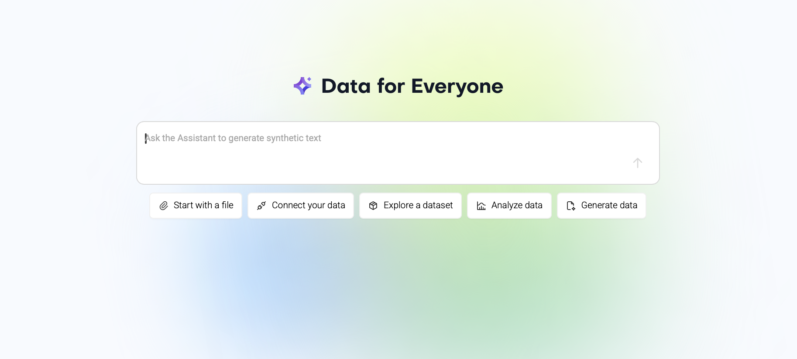

# AWS and MOSTLY AI


## Contents

1. [Introduction](#introduction)
2. [Getting Started with MOSTLY AI](#getting-started-with-mostly-ai)
    - [Platform](#platform)
    - [Synthetic Data SDK](#synthetic-data-sdk)
    - [MOSTLY AI Model Context Protocol (MCP) Server](#mostly-ai-model-context-protocol-mcp-server)
    - [MOSTLY Mock](#mostly-mock)
3. 

## Introduction

MOSTLY AI and AWS have announced a strategic partnership to bring world-class synthetic data to everyone.

With the synthetic and mock data generation abilities of MOSTLY AI and the infrastructure and reach of AWS, we're joining forces to empower every organization to make the most of their data without sacrificing privacy or utility.

[](https://www.youtube.com/watch?v=961lTRpUPuk)

*Watch the launch video on the Data Democratization Podcast on YouTube* 

## Getting started with MOSTLY AI

We've developed this guide as an overview of the MOSTLY AI platform and supporting tools.

MOSTLY AI is a powerful platform that supports a range of functionalities. These terms will help you understand how the get what you want from the entire MOSTLY AI ecosystem:

1. Generator: a generator is a collection of specially trained AI models that are used together to create synthetic data.
2. Connector: a connector is a connection string or set of credentials used to connect to an underlying data source or write to an external destination.
3. Dataset: a dataset is a set of instructions, file, or connection that allow you to access data that may or may not be stored on the platform.
4. Synthetic Dataset: a synthetic dataset is a dataset that has been created using the MOSTLY AI platform or Synthetic Data SDK and contains the features and trends present in a subject dataset.

### Platform



The best place to get started is the [MOSTLY AI platform](http://app.mostly.ai) but we support a number a complementary tools to ensure that you have access to the most realistic mock or synthetic data possible.

> For more information on using the platform effectively, consider the [MOSTLY AI Docs](https://mostly.ai/docs/).

Use the platform to chat with the MOSTLY AI Assistant, who can help you train generators, create synthetic datasets, and configure connectors using natural language prompting. Chatting with the Assistant is the best place to start learning about using MOSTLY AI to create synthetic data.

### Synthetic Data SDK

```python
# Initialize the SDK
from mostlyai.sdk import MostlyAI
mostly = MostlyAI()

# Import a trained generator
g = mostly.generators.import_from_file(
  "https://github.com/mostly-ai/public-demo-data/raw/dev/census/census-generator.zip"
)

# Probe for 1000 representative synthetic samples
df = mostly.probe(g, size=1000)
df
```

The MOSTLY AI platform is powered by the Synthetic Data SDK, an open source toolkit that you can use to create the data you need.

The methods and endpoints of the SDK are [extensively documented](https://api-docs.mostly.ai), including [usage examples and suggested configurations](https://mostly-ai.github.io/mostlyai/), and the entire codebase can be inspected in a [public repository](https://github.com/mostly-ai/mostlyai?tab=readme-ov-file#synthetic-data-sdk-).

### MOSTLY AI Model Context Protocol (MCP) Server


### MOSTLY Synthetic Mock

```python
from mostlyai import mock

tables = {
    "guests": {
        "prompt": "Guests of an Alpine ski hotel in Austria",
        "columns": {
            "nationality": {"prompt": "2-letter code for the nationality", "dtype": "string"},
            "name": {"prompt": "first name and last name of the guest", "dtype": "string"},
            "gender": {"dtype": "category", "values": ["male", "female"]},
            "age": {"prompt": "age in years; min: 18, max: 80; avg: 25", "dtype": "integer"},
            "date_of_birth": {"prompt": "date of birth", "dtype": "date"},
            "checkin_time": {"prompt": "the check in timestamp of the guest; may 2025", "dtype": "datetime"},
            "is_vip": {"prompt": "is the guest a VIP", "dtype": "boolean"},
            "price_per_night": {"prompt": "price paid per night, in EUR", "dtype": "float"},
            "room_number": {"prompt": "room number", "dtype": "integer", "values": [101, 102, 103, 201, 202, 203, 204]}
        },
    }
}
df = mock.sample(
    tables=tables,   # provide table and column definitions
    sample_size=10,  # generate 10 records
    model="openai/gpt-4.1-nano",  # select the LLM model
)
```

Mock data is differentiated from synthetic data in that mock data is created entirely from scratch, with no underlying subject data upon which to model. You can use mock data to expand an existing subject dataset if you wish, but it is not required to have any data to start the process.

Mock data is helpful for testing data model structure and shape in a development or staging environment, when real-world subject data may not be available or the underlying data model is subject to rapid iteration and change.

The [MOSTLY Synthetic Mock repository](https://github.com/mostly-ai/mostlyai-mock?tab=readme-ov-file#synthetic-mock-data-) supports natural language prompting and a declarative syntax to ensure that the generated mock data meets your exact requirements.